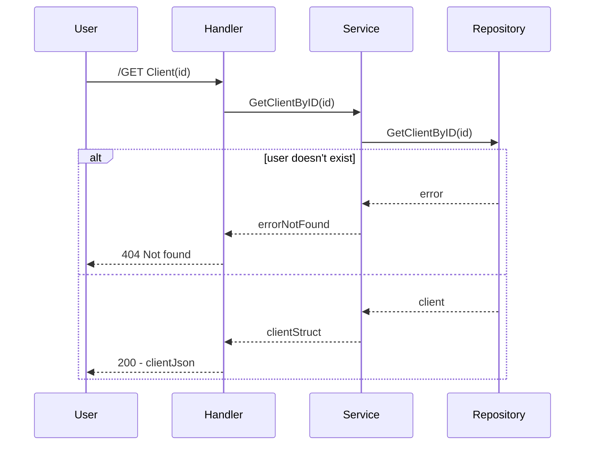

# Business Problem

This project provides a CRUD web service for clients.

## Use cases

This is an example of a sequence diagram created using mermaid editor:

### Get one client

GET /clients/{id}

